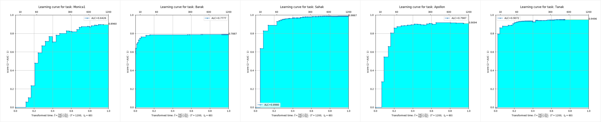

[English](./README_EN.md) | 简体中文

<p align="center">

[](http://hits.dwyl.com/DeepWisdom/AutoDL)

[](https://github.com/DeepWisdom/AutoDL/issues)

[](https://github.com/DeepWisdom/AutoDL/network)
[](https://github.com/DeepWisdom/AutoDL/stargazers)

[](https://github.com/DeepWisdom/AutoDL/blob/master/LICENSE)

[](https://github.com/DeepWisdom/AutoDL#%E5%8A%A0%E5%85%A5%E7%A4%BE%E5%8C%BA)
</p>


<!-- # NeurIPS AutoDL Challenge 冠军方案 -->


[AutoDL Challenge@NeurIPS](https://autodl.chalearn.org/neurips2019) 冠军方案，竞赛细节参见 [AutoDL Competition](https://autodl.lri.fr/competitions/162)。

# 1. AutoDL是什么？

AutoDL聚焦于自动进行任意模态（图像、视频、语音、文本、表格数据）多标签分类的通用算法，可以用一套标准算法流解决现实世界的复杂分类问题，解决调数据、特征、模型、超参等烦恼，最短10秒就可以做出性能优异的分类器。本工程在**不同领域的24个离线数据集、15个线上数据集都获得了极为优异的成绩**。AutoDL拥有以下特性：

☕ **全自动**：全自动深度学习/机器学习框架，全流程无需人工干预。数据、特征、模型的所有细节都已调节至最佳，统一解决了资源受限、数据倾斜、小数据、特征工程、模型选型、网络结构优化、超参搜索等问题。**只需要准备数据，开始AutoDL，然后喝一杯咖啡**。

🌌 **通用性**：支持**任意**模态，包括图像、视频、音频、文本和结构化表格数据，支持**任意多标签分类问题**，包括二分类、多分类、多标签分类。它在**不同领域**都获得了极其优异的成绩，如行人识别、行人动作识别、人脸识别、声纹识别、音乐分类、口音分类、语言分类、情感分类、邮件分类、新闻分类、广告优化、推荐系统、搜索引擎、精准营销等等。

👍 **效果出色**：AutoDL竞赛获得压倒性优势的冠军方案，包含对传统机器学习模型和最新深度学习模型支持。模型库包括从LR/SVM/LGB/CGB/XGB到ResNet*/MC3/DNN/ThinResnet*/TextCNN/RCNN/GRU/BERT等优选出的冠军模型。

⚡ **极速/实时**：最快只需十秒即可获得极具竞争力的模型性能。结果实时刷新（秒级），无需等待即可获得模型实时效果反馈。

# 2. 目录
<!-- TOC -->

- [1. AutoDL是什么？](#1-autodl是什么)
- [2. 目录](#2-目录)
- [3. 效果](#3-效果)
- [4. AutoDL竞赛使用说明](#4-autodl竞赛使用说明)
    - [4.1. 使用效果示例（横轴为对数时间轴，纵轴为AUC）](#41-使用效果示例横轴为对数时间轴纵轴为auc)
- [5. 安装](#5-安装)
    - [5.1. pip 安装](#51-pip-安装)
- [6. 快速上手](#6-快速上手)
    - [6.1. 快速上手之AutoDL本地效果测试](#61-快速上手之autodl本地效果测试)
    - [6.2. 快速上手之图像分类](#62-快速上手之图像分类)
    - [6.3. 快速上手之视频分类](#63-快速上手之视频分类)
    - [6.4. 快速上手之音频分类](#64-快速上手之音频分类)
    - [6.5. 快速上手之文本分类](#65-快速上手之文本分类)
    - [6.6. 快速上手之表格分类](#66-快速上手之表格分类)
- [7. 可用数据集](#7-可用数据集)
    - [7.1. (可选) 下载数据集](#71-可选-下载数据集)
    - [7.2. 公共数据集信息](#72-公共数据集信息)
- [8. 贡献代码](#8-贡献代码)
- [9. 加入社区](#9-加入社区)
- [10. 开源协议](#10-开源协议)

<!-- /TOC -->


# 3. 效果
- **预赛榜单（DeepWisdom总分第一，平均排名1.2，在5个数据集中取得了4项第一）**


- **决赛榜单（DeepWisdom总分第一，平均排名1.8，在10个数据集中取得了7项第一）**


# 4. AutoDL竞赛使用说明

1. 基础环境
    ```shell script
    python>=3.5
    CUDA 10
    cuDNN 7.5
    ```

2. clone仓库 
    ```
    cd <path_to_your_directory>
    git clone https://github.com/DeepWisdom/AutoDL.git
    ```
3. 预训练模型准备
下载模型 [speech_model.h5](https://github.com/DeepWisdom/AutoDL/releases/download/opensource/thin_resnet34.h5) 放至 `AutoDL_sample_code_submission/at_speech/pretrained_models/` 目录。

4. 可选：使用与竞赛同步的docker环境 
    - CPU
    ```
    cd path/to/autodl/
    docker run -it -v "$(pwd):/app/codalab" -p 8888:8888 evariste/autodl:cpu-latest
    ```
    - GPU
    ```
    nvidia-docker run -it -v "$(pwd):/app/codalab" -p 8888:8888 evariste/autodl:gpu-latest
    ```
5. 数据集准备：使用 `AutoDL_sample_data` 中样例数据集，或批量下载竞赛公开数据集。

6. 进行本地测试
    ```
    python run_local_test.py
    ```
本地测试完整使用。
    ```
    python run_local_test.py -dataset_dir='AutoDL_sample_data/miniciao' -code_dir='AutoDL_sample_code_submission'
    ```
您可在 `AutoDL_scoring_output/` 目录中查看实时学习曲线反馈的HTML页面。

细节可参考 [AutoDL Challenge official starting_kit](https://github.com/zhengying-liu/autodl_starting_kit_stable).

## 4.1. 使用效果示例（横轴为对数时间轴，纵轴为AUC）



可以看出，在五个不同模态的数据集下，AutoDL算法流都获得了极为出色的全时期效果，可以在极短的时间内达到极高的精度。

# 5. 安装 

本仓库在 Python 3.6+, PyTorch 1.3.1 和 TensorFlow 1.15上测试.

你应该在[虚拟环境](https://docs.python.org/3/library/venv.html) 中安装autodl。
如果对虚拟环境不熟悉，请看 [用户指导](https://packaging.python.org/guides/installing-using-pip-and-virtual-environments/).

用合适的Python版本创建虚拟环境，然后激活它。

## 5.1. pip 安装

AutoDL 能用以下方式安装:

```bash
pip install autodl-gpu
```

# 6. 快速上手
## 6.1. 快速上手之AutoDL本地效果测试
指导参见 [快速上手之AutoDL本地效果测试](https://github.com/DeepWisdom/AutoDL/tree/pip/docs/run_local_test_tutorial_chn.md)，样例代码参见 [examples/run_local_test.py](https://github.com/DeepWisdom/AutoDL/blob/pip/examples/run_local_test.py)

## 6.2. 快速上手之图像分类
参见 [快速上手之图像分类](https://github.com/DeepWisdom/AutoDL/tree/pip/docs/image_classification_tutorial_chn.md)，样例代码参见 [examples/run_image_classification_example.py](https://github.com/DeepWisdom/AutoDL/blob/pip/examples/run_image_classification_example.py)

## 6.3. 快速上手之视频分类
指导参见 [快速上手之视频分类](https://github.com/DeepWisdom/AutoDL/tree/pip/docs/video_classification_tutorial_chn.md)，样例代码参见[examples/run_video_classification_example.py](https://github.com/DeepWisdom/AutoDL/blob/pip/examples/run_video_classification_example.py)

## 6.4. 快速上手之音频分类
指导参见 [快速上手之音频分类](https://github.com/DeepWisdom/AutoDL/tree/pip/docs/speech_classification_tutorial_chn.md)，样例代码参见[examples/run_speech_classification_example.py](https://github.com/DeepWisdom/AutoDL/blob/pip/examples/run_speech_classification_example.py)

## 6.5. 快速上手之文本分类
指导参见 [快速上手之文本分类](https://github.com/DeepWisdom/AutoDL/tree/pip/docs/text_classification_tutorial_chn.md)，样例代码参见[examples/run_text_classification_example.py](https://github.com/DeepWisdom/AutoDL/blob/pip/examples/run_text_classification_example.py)。

## 6.6. 快速上手之表格分类
指导参见 [快速上手之表格分类](https://github.com/DeepWisdom/AutoDL/tree/pip/docs/tabular_classification_tutorial_chn.md)，样例代码参见[examples/run_tabular_classification_example.py](https://github.com/DeepWisdom/AutoDL/blob/pip/examples/run_tabular_classification_example.py).


# 7. 可用数据集
## 7.1. (可选) 下载数据集
```bash
python download_public_datasets.py
```

## 7.2. 公共数据集信息
| #   | Name     | Type    | Domain   | Size   | Source      | Data (w/o test labels) | Test labels       |
| --- | -------- | ------- | -------- | ------ | ----------- | ---------------------- | ----------------- |
| 1   | Munster  | Image   | HWR      | 18 MB  | MNIST       | munster.data           | munster.solution  |
| 2   | City     | Image   | Objects  | 128 MB | Cifar-10    | city.data              | city.solution     |
| 3   | Chucky   | Image   | Objects  | 128 MB | Cifar-100   | chucky.data            | chucky.solution   |
| 4   | Pedro    | Image   | People   | 377 MB | PA-100K     | pedro.data             | pedro.solution    |
| 5   | Decal    | Image   | Aerial   | 73 MB  | NWPU VHR-10 | decal.data             | decal.solution    |
| 6   | Hammer   | Image   | Medical  | 111 MB | Ham10000    | hammer.data            | hammer.solution   |
| 7   | Kreatur  | Video   | Action   | 469 MB | KTH         | kreatur.data           | kreatur.solution  |
| 8   | Kreatur3 | Video   | Action   | 588 MB | KTH         | kreatur3.data          | kreatur3.solution |
| 9   | Kraut    | Video   | Action   | 1.9 GB | KTH         | kraut.data             | kraut.solution    |
| 10  | Katze    | Video   | Action   | 1.9 GB | KTH         | katze.data             | katze.solution    |
| 11  | data01   | Speech  | Speaker  | 1.8 GB | --          | data01.data            | data01.solution   |
| 12  | data02   | Speech  | Emotion  | 53 MB  | --          | data02.data            | data02.solution   |
| 13  | data03   | Speech  | Accent   | 1.8 GB | --          | data03.data            | data03.solution   |
| 14  | data04   | Speech  | Genre    | 469 MB | --          | data04.data            | data04.solution   |
| 15  | data05   | Speech  | Language | 208 MB | --          | data05.data            | data05.solution   |
| 16  | O1       | Text    | Comments | 828 KB | --          | O1.data                | O1.solution       |
| 17  | O2       | Text    | Emotion  | 25 MB  | --          | O2.data                | O2.solution       |
| 18  | O3       | Text    | News     | 88 MB  | --          | O3.data                | O3.solution       |
| 19  | O4       | Text    | Spam     | 87 MB  | --          | O4.data                | O4.solution       |
| 20  | O5       | Text    | News     | 14 MB  | --          | O5.data                | O5.solution       |
| 21  | Adult    | Tabular | Census   | 2 MB   | Adult       | adult.data             | adult.solution    |
| 22  | Dilbert  | Tabular | --       | 162 MB | --          | dilbert.data           | dilbert.solution  |
| 23  | Digits   | Tabular | HWR      | 137 MB | MNIST       | digits.data            | digits.solution   |
| 24  | Madeline | Tabular | --       | 2.6 MB | --          | madeline.data          | madeline.solution |


# 8. 贡献代码 

❤️ 请毫不犹豫参加贡献 [Open an issue](https://github.com/DeepWisdom/AutoDL/issues/new) 或提交 PRs。

# 9. 加入社区


# 10. 开源协议 
[Apache License 2.0](https://github.com/DeepWisdom/AutoDL/blob/master/LICENSE)
