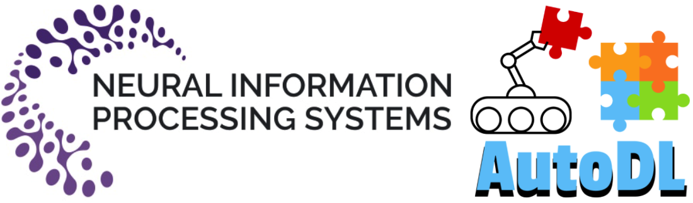
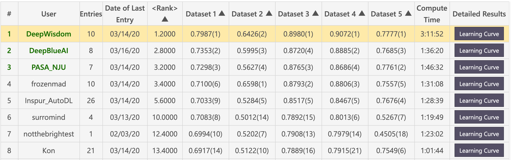
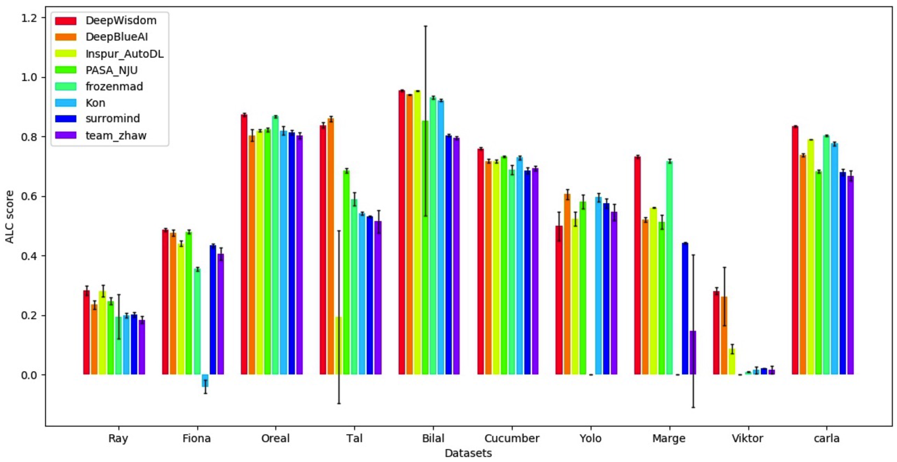

English | [简体中文](./README.md)

# NeurIPS AutoDL Challenge 1'st Solution



**1st** solution for [AutoDL Challenge@NeurIPS](https://autodl.chalearn.org/neurips2019), competition rules can be found at [AutoDL Competition](https://autodl.lri.fr/competitions/162).

### Motivation 
There exists a series of common and tough problems in the real world, such as limited resources (CPU/ memory), skwed data, hand-craft features, model selection, network architecture details tuning, sensitivity of pre-trained models, sensitivity of hyperparameters, and so on. How to solve them once efficiently?


### Solution 
AutoDL concentrates on developing generic algorithms for multi-label classification problems in ANY modalities: image, video, speech, text and tabular data without ANY human intervention. Our solution got SOTA performances on all the 24 offline datasets and 15 online datasets, beating a number of top players in the world.


## Table of Contents
<!-- TOC -->

- [NeurIPS AutoDL Challenge 1'st Solution](#neurips-autodl-challenge-1st-solution)
    - [Motivation](#motivation)
    - [Solution](#solution)
  - [Table of Contents](#table-of-contents)
  - [Features](#features)
  - [Evaluation](#evaluation)
  - [Public Datasets](#public-datasets)
    - [Optional: Download public datasets](#optional-download-public-datasets)
    - [Public datasets sample info](#public-datasets-sample-info)
  - [Usage for local development and testing](#usage-for-local-development-and-testing)
  - [Contributing](#contributing)
  - [Contact us](#contact-us)
  - [Join the Community](#join-the-community)
  - [License](#license)

<!-- /TOC -->


## Features
- **Full-AutoML/AutoDL**: Fully automated Deep Learning without ANY human intervention covering the whole pipelines.
- **Generic & Universal**: Supporting ANY modality(image, video, speech, text, tabular) data, and **ANY** classification problems including binary-class, multi-class and multi-label problems.
- **SOTA**: Winner solution of AutoDL challenge, involving both tranditional machine learning models and deep learning model backbones. 
- **Out-of-the-Box**: You can use the solution out-of-the-box.
- **Fast**: You can train your model in **ten seconds** at the soonest to get highly competitive performance.
- **Real-time**: You can get the performance feedback(AUC score) in real time.


## Evaluation


- **Feedback-phase leaderboard: DeepWisdom Top 1, average rank 1.2, won 4 out of 5 datasets.**


- 
- **Final-phase leaderboard visualization: DeepWisdom Top 1, average rank 1.2, won 7 out of 10 datasets.**


## Public Datasets
### Optional: Download public datasets
```bash
python download_public_datasets.py
```

### Public datasets sample info 
| #   | Name     | Type    | Domain   | Size   | Source      | Data (w/o test labels) | Test labels       |
| --- | -------- | ------- | -------- | ------ | ----------- | ---------------------- | ----------------- |
| 1   | Munster  | Image   | HWR      | 18 MB  | MNIST       | munster.data           | munster.solution  |
| 2   | City     | Image   | Objects  | 128 MB | Cifar-10    | city.data              | city.solution     |
| 3   | Chucky   | Image   | Objects  | 128 MB | Cifar-100   | chucky.data            | chucky.solution   |
| 4   | Pedro    | Image   | People   | 377 MB | PA-100K     | pedro.data             | pedro.solution    |
| 5   | Decal    | Image   | Aerial   | 73 MB  | NWPU VHR-10 | decal.data             | decal.solution    |
| 6   | Hammer   | Image   | Medical  | 111 MB | Ham10000    | hammer.data            | hammer.solution   |
| 7   | Kreatur  | Video   | Action   | 469 MB | KTH         | kreatur.data           | kreatur.solution  |
| 8   | Kreatur3 | Video   | Action   | 588 MB | KTH         | kreatur3.data          | kreatur3.solution |
| 9   | Kraut    | Video   | Action   | 1.9 GB | KTH         | kraut.data             | kraut.solution    |
| 10  | Katze    | Video   | Action   | 1.9 GB | KTH         | katze.data             | katze.solution    |
| 11  | data01   | Speech  | Speaker  | 1.8 GB | --          | data01.data            | data01.solution   |
| 12  | data02   | Speech  | Emotion  | 53 MB  | --          | data02.data            | data02.solution   |
| 13  | data03   | Speech  | Accent   | 1.8 GB | --          | data03.data            | data03.solution   |
| 14  | data04   | Speech  | Genre    | 469 MB | --          | data04.data            | data04.solution   |
| 15  | data05   | Speech  | Language | 208 MB | --          | data05.data            | data05.solution   |
| 16  | O1       | Text    | Comments | 828 KB | --          | O1.data                | O1.solution       |
| 17  | O2       | Text    | Emotion  | 25 MB  | --          | O2.data                | O2.solution       |
| 18  | O3       | Text    | News     | 88 MB  | --          | O3.data                | O3.solution       |
| 19  | O4       | Text    | Spam     | 87 MB  | --          | O4.data                | O4.solution       |
| 20  | O5       | Text    | News     | 14 MB  | --          | O5.data                | O5.solution       |
| 21  | Adult    | Tabular | Census   | 2 MB   | Adult       | adult.data             | adult.solution    |
| 22  | Dilbert  | Tabular | --       | 162 MB | --          | dilbert.data           | dilbert.solution  |
| 23  | Digits   | Tabular | HWR      | 137 MB | MNIST       | digits.data            | digits.solution   |
| 24  | Madeline | Tabular | --       | 2.6 MB | --          | madeline.data          | madeline.solution |


## Usage for local development and testing
1. Git clone the repo
```
cd <path_to_your_directory>
git clone https://github.com/DeepWisdom/AutoDL.git
```
2. Prepare pretrained models.
Download model [speech_model.h5](https://github.com/DeepWisdom/AutoDL/releases/download/opensource/thin_resnet34.h5) and put it to `AutoDL_sample_code_submission/at_speech/pretrained_models/` directory.

3. Optional: run in the exact same environment as on the challenge platform with docker. 
    - CPU
    ```
    cd path/to/autodl/
    docker run -it -v "$(pwd):/app/codalab" -p 8888:8888 evariste/autodl:cpu-latest
    ```
    - GPU
    ```
    nvidia-docker run -it -v "$(pwd):/app/codalab" -p 8888:8888 evariste/autodl:gpu-latest
    ```
4. Prepare sample datasets, using the toy data in `AutoDL_sample_data` or download new datasets.

5. Run local test
```
python run_local_test.py
```
The full usage is
```
python run_local_test.py -dataset_dir='AutoDL_sample_data/miniciao' -code_dir='AutoDL_sample_code_submission'
```
Then you can view the real-time feedback with a learning curve by opening the
HTML page in `AutoDL_scoring_output/`.


Details can be seen in [AutoDL Challenge official starting_kit](https://github.com/zhengying-liu/autodl_starting_kit_stable).


## Contributing

Feel free to dive in! [Open an issue](https://github.com/DeepWisdom/AutoDL/issues/new) or submit PRs.

## Contact us
[](http://fuzhi.ai/)


## Join the Community
Scan QR code and join AutoDL community!


## License
[Apache License 2.0](https://github.com/DeepWisdom/AutoDL/blob/master/LICENSE)
