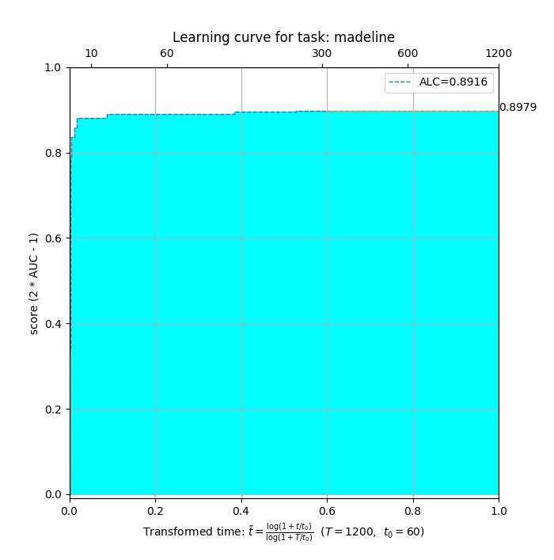

# 走进AutoDL之任意模态动态效果查看


## 公共操作
```shell script
pip install autodl-gpu
```

## 数据集准备
AutoDL竞赛TFRecords格式数据集下载页面，见 [https://autodl.lri.fr/competitions/162#learn_the_details-get_data](https://autodl.lri.fr/competitions/162#learn_the_details-get_data]).

## 数据集查看
以表格Tabular-Madline数据集为例，结构为，
```shell script
madeline/
├── madeline.data
│   ├── test
│   │   ├── metadata.textproto
│   │   └── sample-madeline-test.tfrecord
│   └── train
│       ├── metadata.textproto
│       └── sample-madeline-train.tfrecord
└── madeline.solution
```

## 本地运行测试
```shell script
python run_local_test.py --dataset_dir=../adl_sample_data/madeline --output_dir=out_madline
```

- 本地实时效果查看
效果目录结构为，
```shell script
out_madline
├── end.txt
├── learning-curve-madeline.png
└── scores.txt
```

- 查看时间轴-评估值
```shell script
$ cat scores.txt
score: 0.8916352545169604
Duration: 313.37918496131897
timestamps: [0.2661712169647217, 0.358626127243042, 0.5197992324829102, 0.7053606510162354, 2.0921311378479004, 3.166487693786621, 18.54700016975403, 21.077122688293457, 133.44777727127075, 163.60578680038452, 239.44151878356934, 240.8310272693634, 244.87188410758972, 246.6099841594696, 248.34655594825745, 249.96118783950806, 251.53502774238586, 253.08051919937134, 254.67323350906372, 256.2774043083191, 257.870441198349, 259.4801936149597, 261.0830600261688, 262.7477779388428, 264.3684663772583, 265.94553232192993, 267.49977803230286, 269.1106107234955, 270.8200764656067, 272.4221224784851, 274.03082370758057, 275.6341016292572, 277.3246235847473, 278.9367325305939, 280.51135063171387, 282.060271024704, 283.6547396183014, 285.396541595459, 287.0492379665375, 288.7354791164398, 290.42046666145325, 292.104416847229, 293.90572714805603, 295.5476541519165, 297.21715664863586, 298.8961863517761, 300.71706461906433, 302.5437366962433, 304.24191641807556, 305.97814989089966, 308.06502413749695, 310.0323050022125, 311.727641582489, 313.3738684654236, 313.37918496131897]
nauc_scores: [0.33550842600721875, 0.626576065749683, 0.7899282691932494, 0.8372491098429422, 0.8595678165544824, 0.8803752377816798, 0.8904862940200955, 0.8904862940200955, 0.8963470027314409, 0.8963515754560532, 0.897914685152668, 0.8979162093942055, 0.8979162093942055, 0.8979162093942055, 0.8979162093942055, 0.8979162093942055, 0.8979162093942055, 0.8979162093942055, 0.8979162093942055, 0.8979162093942055, 0.8979162093942055, 0.8979162093942055, 0.8979162093942055, 0.8979162093942055, 0.8979162093942055, 0.8979162093942055, 0.8979162093942055, 0.8979162093942055, 0.8979162093942055, 0.8979162093942055, 0.8979162093942055, 0.8979162093942055, 0.8979162093942055, 0.8979162093942055, 0.8979162093942055, 0.8979162093942055, 0.8979162093942055, 0.8979162093942055, 0.8979162093942055, 0.8979162093942055, 0.8979162093942055, 0.8979162093942055, 0.8979162093942055, 0.8979162093942055, 0.8979162093942055, 0.8979162093942055, 0.8979162093942055, 0.8979162093942055, 0.8979162093942055, 0.8979162093942055, 0.8979162093942055, 0.8979162093942055, 0.8979162093942055, 0.8979162093942055, 0.8979162093942055]
accuracy: [0.5391453066252385, 0.6131523846229572, 0.6815605409256198, 0.702184568553094, 0.7463193322248111, 0.7682445714109934, 0.7909825496203651, 0.7909825496203651, 0.7856689203176399, 0.7856646636403509, 0.7014472018683021, 0.7013572341642722, 0.7013572341642722, 0.7013572341642722, 0.7013572341642722, 0.7013572341642722, 0.7013572341642722, 0.7013572341642722, 0.7013572341642722, 0.7013572341642722, 0.7013572341642722, 0.7013572341642722, 0.7013572341642722, 0.7013572341642722, 0.7013572341642722, 0.7013572341642722, 0.7013572341642722, 0.7013572341642722, 0.7013572341642722, 0.7013572341642722, 0.7013572341642722, 0.7013572341642722, 0.7013572341642722, 0.7013572341642722, 0.7013572341642722, 0.7013572341642722, 0.7013572341642722, 0.7013572341642722, 0.7013572341642722, 0.7013572341642722, 0.7013572341642722, 0.7013572341642722, 0.7013572341642722, 0.7013572341642722, 0.7013572341642722, 0.7013572341642722, 0.7013572341642722, 0.7013572341642722, 0.7013572341642722, 0.7013572341642722, 0.7013572341642722, 0.7013572341642722, 0.7013572341642722, 0.7013572341642722, 0.7013572341642722]
```
- 查看实时可视化效果



可见只需3秒NAUC即可超过0.85，此时AUC达到0.92，十分钟可达到NAUC=0.89的最优效果，即最优AUC接近0.95。
